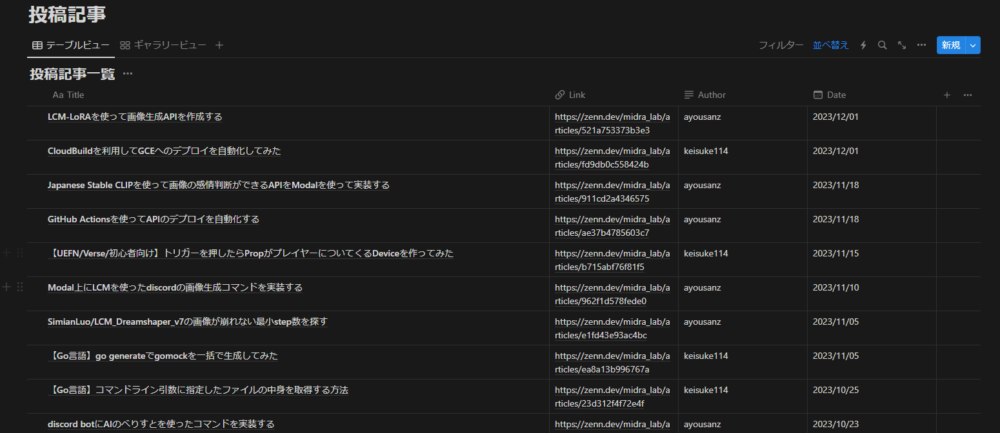

# zenn-article-aggregator
ZennのPublicationに投稿された記事のタイトル、リンク、著者を取得して、NotionのDBにまとめるツール

<!-- START doctoc generated TOC please keep comment here to allow auto update -->
<!-- DON'T EDIT THIS SECTION, INSTEAD RE-RUN doctoc TO UPDATE -->
**Table of Contents**

- [Demo](#demo)
- [セットアップ](#%E3%82%BB%E3%83%83%E3%83%88%E3%82%A2%E3%83%83%E3%83%97)

<!-- END doctoc generated TOC please keep comment here to allow auto update -->

# Demo

[MidraLab HP](https://midra-lab.notion.site/7ab2d6ad6b5e4c6487220ac360e6d8ec?v=340f109e5ced4ae99afad0f0ea4c8c62)にて以下のような画像のように取得したデータを反映させています。

# セットアップ
1. NotionAPIのトークンおよび反映させたいNotion DBのIdを取得する
2. NotionAPIのトークンをGitHub Actionsの環境変数に設定する
3. Repositoryをforkして、`main.py`の `publication_url` を自分のPublicationのURLに書き換える